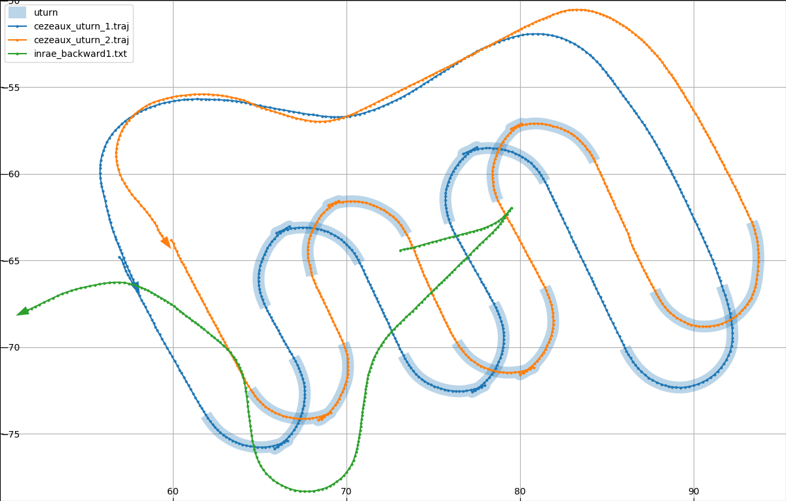
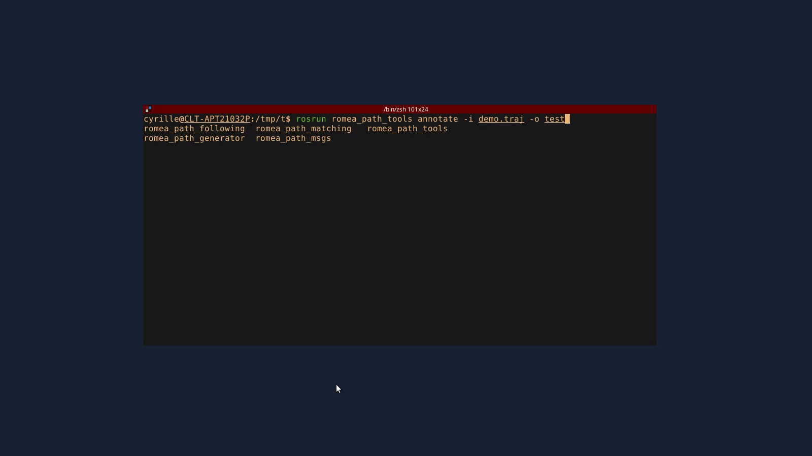

This package contains several programs to show, create, or edit trajectory files.
The main format of the trajectory is named _tiara_ and uses the `.traj` extension. Some of these
tools also handle the old format _romea v1_ but is now deprecated.
Here is the list of the available tools:

* **`annotate`**: basic GUI used to add zone annotations to a trajectory file
* **`convert`**: convert a trajectory file in one the following format : `romea_v1`, `tiara`, `csv`,
  `kml`, `wgs84_csv`, `geojson`
* **`show`**: show one or several trajectories on a basic GUI (matplotlib)
* **`planner`**: (requires Fields2Cover) generate a trajectory that cover an agricultural field.

## Trajectory file format

The file formats used by romea ROS nodes are
* [TIARA trajectory format](doc/tiara_format.md) (extension: `.traj`)
* ROMEA trajectory format (deprecated) (extension: `.txt`)


## Desccription of applications

### show

This program opens a matplotlib window containing the (x, y) coordinates of the loaded trajectories
and also the area defined by the annotations.
You can use it as follows (considering that the file `a.traj` exists locally):
```
ros2 run romea_path_tools show a.traj
```
And here is an example of what the program will show:



You can obtain the documentation of the program using `-h` option:
```
usage: show [-h] path [paths [paths ...]]

Plot several paths in the coordinate (anchor) of the first one. If the filename ends with
'.json', it is considered as a tiara trajectory, else it is considered as a romea trajectory
(old version).

positional arguments:
  path        first romea path file
  paths       other romea path files

optional arguments:
  -h, --help  show this help message and exit
```

### annotate

This program opens a matplotlib window containing the (x, y) coordinates of the loaded trajectory
and also the already defined area.
You can then add new area by drawing polygons using the mouse:

* a left click allows to add a point to the polygon
* a right click close the current polygon

The command line requires to specify the input file (`-i` option), the output file (`-o` option) and
the zone name (`-z` option).
For example:
```
ros2 run romea_path_tools annotate -i demo.traj -o test.traj -z uturn
```

Here is an overview of how it works:



You can obtain the documentation of the program using `-h` option:
```
usage: annotate [-h] -z ZONE -i INPUT -o OUTPUT

Generate annotations in a trajectory file

optional arguments:
  -h, --help            show this help message and exit
  -z ZONE, --zone ZONE  name of the zone
  -i INPUT, --input INPUT
                        path of the trajectory file
  -o OUTPUT, --output OUTPUT
                        path of the output trajectory
```

### convert

This program allows to convert a trajectory from one format to another.
It is also possible to do some transformations like translation, rotation and changing the origin
point.
Here is the list of the handled trajectory formats:

* a TIARA trajectory file (extension: `.traj`)
* a list of (x, y) points in a east-north-up cartesian frame (extension: `.csv`)
* a list of (latitude, longitude) points in WGS84 coordinates (extension: `.wgs84.csv`)
* a KML file containing a unique polygon or linestring (extension: `.kml`)
* a GeoJSON file containing a unique polygon or linestring (extension: `.geojson`)
* the old romea format (extension: `.txt`)

You can obtain the documentation of the program using `-h` option:
```
usage: convert [-h] [-a lat lon alt] [-o x y] [-r angle] [-t type] [-f] path_in path_out

Convert a path file to a new one with some transformations. Is is possible to export the
trajectory to a new format by using the -t option or by specifying the correct file
extension. The known extensions are '.txt' (for old romea format for trajectories), '.traj'
(for the tiara format for trajectories), '.csv' (for CSV points in east-north-up
coordinates), '.wgs84.csv' (for CSV points in WGS84 coordinates), '.kml' (for the KML
standard format), '.geojson' (for the GeoJSON standard format). For input files, only '.txt'
and '.traj' are accepted.

positional arguments:
  path_in               path to a '.txt' or a '.traj' path file
  path_out              generated path file

optional arguments:
  -h, --help            show this help message and exit
  -a lat lon alt, --anchor lat lon alt
                        a new anchor (format: latitude longitude altitude)
  -o x y, --offset x y  an (x, y) offset to apply to the points (format: x y)
  -r angle, --rotation angle
                        apply a rotation to the points (in degrees)
  -t type, --type type  file format of the generated path [romea_v1, tiara, csv, kml,
                        wgs84_csv, geojson]. If the format is not specified, the file
                        extension is used.
  -f, --force           override existing output file
```

### planner

This programs allows to generate a `.traj` file that cover an agricultural field.
This programs requires to compile
[Fields2Cover](https://fields2cover.github.io/source/installation.html#compilation-with-python-interface)
with the python API.
A Dockerfile is provided to compile it over the tirrex docker image.
You can build it using (from the root of this project):
```bash
docker compose build
```

This will create a new docker image `tirrex_workspace:${USER}_f2c` that you can use instead of the
default one in the `bash` service of the tirex workspace.

You can obtain the documentation of the program using `-h` option:
```
Usage: planner [OPTIONS] KML_FILENAME

Options:
  -w, --operation-width FLOAT
  -r, --min-radius FLOAT
  -o, --output PATH
  --robot-width FLOAT
  --help                       Show this message and exit.
```


## Create a python script to generate a trajectory

If you want to generate a trajectory from a python script, you can use the python class `Path` that
provide some functions to add points and save the trajectory to a file.
Here is a complete python script that create a short trajectory at INRAE (Aubière):

```python
from romea_path_tools.path import Path

def main():
    path = Path()
    path.name = 'test'
    path.columns = ['x', 'y', 'speed']  # 'x' and 'y' are required (these are the default)
    path.anchor = (45.76277, 3.110397, 403.6)  # INRAE, Aubière, France

    path.append_point([12.5, 3.2, 1.0])
    path.append_point([12.6, 3.2, 1.0])
    path.append_point([12.7, 3.3, 1.0])
    path.append_point([12.75, 3.43, 1.0])

    path.save('/tmp/test.traj')


if __name__ == '__main__':
    main()
```

This script requires than the workspace environment is loaded (the `PYTHONPATH` environment variable
must be correctly filled).
It can be, for example, put in a ROS2 package that includes `romea_path_tools` as dependency.
